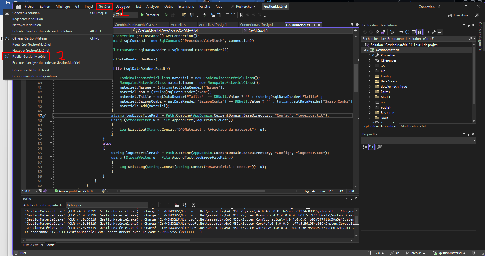
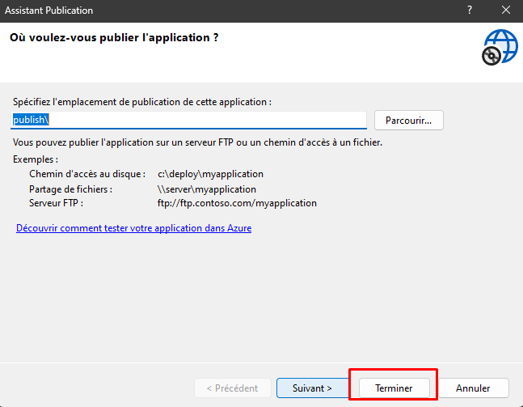
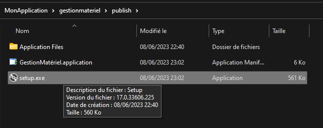
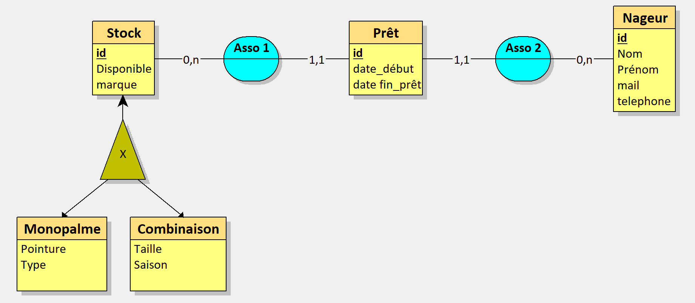
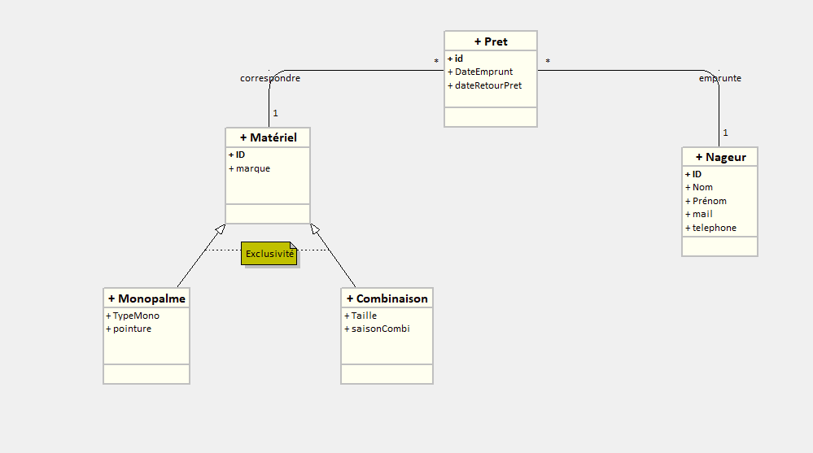
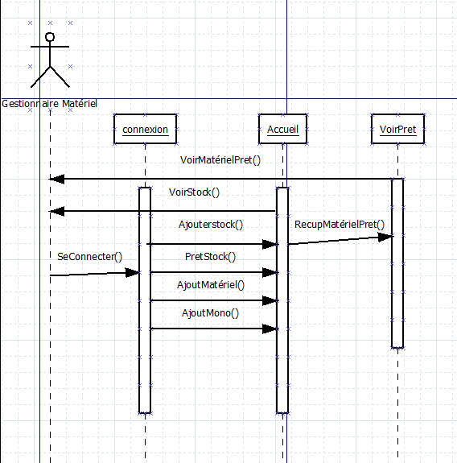

```                                                                                  
  _                       _____      _                
 | |                     |  __ \    | |               
 | |    _   _  ___  _ __ | |__) |_ _| |_ __ ___   ___ 
 | |   | | | |/ _ \| '_ \|  ___/ _` | | '_ ` _ \ / _ \
 | |___| |_| | (_) | | | | |  | (_| | | | | | | |  __/
 |______\__, |\___/|_| |_|_|   \__,_|_|_| |_| |_|\___|
         __/ |                                        
        |___/                                         

```
 
# - Lyon Palme - 
## ***Application : gestion et prêt du matériel.***
  
Projet personnel encadré réalisé par **BOURAGHDA Yasser, HANON Nicolas**,  
étudiant en 2e année de **BTS Services informatiques aux organisations Option SLAM**.  

Professeur : Mme CHATAING  
Sup'Chassagnes - Oullins (69)  
 
---

## Sommaire
1. [Introduction](#1-introduction)  
  1.1. [Présentation de l'application](#11-Présentation-del'application)  
  1.2. [Technologies et savoir-faire mis en oeuvre](#12-technologies-et-savoir-faire-mis-en-oeuvre)  
2. [Utiliser l'application](#2-utiliser-lapplication)  
  2.1. [Environnement logiciel requis](#21-environnement-logiciel-requis)  
  2.2. [Compte SSMS pour ce connecter a la base de données](#22-Compte-SSMS-pour-ce-connecter-a-la-base-de-données)  
  2.3. [Configuration de l'application pour la connexion à la base de données](#23-Configuration-de-l'application-pour-la-connexion-à-la-base-de-données)
  2.3.1 [Chaînes de connexion](#231-Chaînes-de-connexion)    
  2.4. [Authentification dans l'application (formulaire de connexion)](#24-authentification-dans-lapplication-formulaire-de-connexion)   
  2.5. [Navigation entre les formulaires](#25-navigation-entre-les-formulaires)
3. [Annexes](#3-annexes)  
  3.1. [Usercase](#31-Usercase)  
  3.2. [Modèle conceptuel de données](#32-Modèle-conceptuel-de-données)  
  3.3. [Diagramme de classes](#33-diagramme-de-classes)
  3.4. [Diagramme de sequence](#34-diagramme-de-sequence)  
4. [Remerciements](#4-remerciements)  

---

## 1. Introduction
### 1.1. Présentation de l'application
Une application permettant de gérer le matériel du club doit être développée par les personnes du backoffice.
Elle est utilisée par le(s) responsable(s) matériel. Cette application permet d’entrer du matériel en
stock, de faire sortir du matériel du stock, de prêter du matériel à des adhérents.
Elle permet également de « tracer » le matériel c’est-à-dire pour un matériel, connaitre toutes les
personnes à qui il a été prêté. Ceci permet de retrouver la personne responsable en cas de détérioration
du matériel.    

### 1.2. Technologies et savoir-faire mis en oeuvre
+ Langage orienté objet : C#
  + WINDOWS FORMS
    + Flat Design
  + Data Acess
  + Forms
    + Dao
      + Mappage 
    + Fonction
  + MODELS
   + Class Mere
   + Class 
+ DONNES 
  + Base de données relationnelles : SSMS
    + Heritage
    + Liens 1 a * 
    + Procedure stocké 
    + Vue
    + Certificat
    + Chiffrement des données
  + Modélisation des données : UML, MCD
+ Système de contrôle de version :  Git
 
---

## 2. Utiliser l'application  
### 2.1. Environnement logiciel requis
+ Microsoft Windows avec .NET Framework 4.8  
+ Visual Studio code 2019 ou 2022 
+ Sql server management studio 

Informations sur les versions utilisées lors du développement de l'application :  
+ Windows 11 Professionnel 64-bits   
+ SSMS  
+ Visual Studio 2022
+ Visual Studio 2019  

### 2.2. Compte SSMS pour ce connecter a la base de données
Les logins que nous avons crée qui respectent le CRUD :

    USER : yasserbouraghda
    PASSWORD : Lion42500! 
      
Il faudra alors modifier le fichier `app.config` du projet Gestion materiel. Cf. point 2.3.*  

### 2.3. Configuration de l'application pour la connexion à la base de données

Il vous suffit simplement d'ouvrir avec un éditeur de texte le **fichier de configuration `app.config` du projet `GestionMatériel`** (et non pas celui de `GestionMatérielLibrary` !),    
puis de **modifier les valeurs associées aux clés `sourceDonnees` et `proceduresStockees` de la section `appSettings`** : 
  
| Clé                | Valeurs possibles |
|--------------------|-------------------|
| proceduresStockees | oui / non         |
| sourceDonnees      | SSMS              |

*Exemple de section `appSettings` lorsque l'application utilise MySQL sans procédures stockées (configuration par défaut) :*  

    <appSettings>
	    <add key="proceduresStockees" value="non"/>
	    <add key="sourceDonnees" value="mysql"/>
    </appSettings>

#### 2.3.1. Chaînes de connexion
Assurez-vous enfin de personnaliser la **chaîne de connexion** (`sqlserver_creditsio` pour SQL Server) afin de correspondre aux identifiants et caractéristiques de votre base de données.  

Ces chaînes se trouvent dans la section `connectionStrings` du même fichier `app.config`.

```csharp
<?xml version="1.0" encoding="utf-8" ?>
<configuration>
    <configSections>    </configSections>
    <connectionStrings>
        <add name="sqlserver_creditsio" connectionString="Data Source=192.168.100.236;Initial Catalog=yasserbouraghda;User ID=yasserbouraghda;Password=Lion42500!"   providerName="System.Data.SqlClient" />
        <add name="CreditSio.Properties.Settings.yasserbouraghdaConnectionString"   connectionString="Data Source=192.168.100.236;Initial Catalog=yasserbouraghda;Persist Security Info=True;User ID=yasserbouraghda;Password=Lion42500!"   providerName="System.Data.SqlClient" />
    </connectionStrings>
    <startup>
        <supportedRuntime version="v4.0" sku=".NETFramework,Version=v4.7.2" />
    </startup>
</configuration>
```

  

### 2.4. Authentification dans l'application (formulaire de connexion)  
Le(s) responsable(s) du matériel ce connecte a l'application en fournissant l'username et le mot de passe préalablement crée qu'il rentre pour accéder a l'application.
| Identifiant        | Mot de passe      |
|--------------------|-------------------|
| GestMat            | C1Secret!         |

     
### 2.5. Navigation entre les formulaires
#### 2.5.1. Formulaire de connexion
La première interface visible par l'utilisateur est le formulaire de connexion, qui demande au responsable du matériel de saisir ses identifiant et mot de passe et les vérifie auprès de la base de données.  
+ En cas d'identifiants erronés, le formulaire en informe l'utilisateur, qui peut les saisir de nouveau ou bien quitter l'application.
+ *ATTENTION* dans le cas où le serveur de base de données est inaccessible, la connexion sera toujours possible, mais ca n'affichera aucun éléments dans les différents formulaire de notre application, étant donné que le compte est gérer dans C#. 

#### 2.5.2. Formulaire Accueil
Une fois l'authentification réussie, l'utilisateur est amené au formulaire principal de l'application.    
L'interface Accueil est composé en deux partie
| Premiere partie    | Second Partie     |
|--------------------|-------------------|
| Navbar             | formulaire stock  |

+ Premiere partie
  + une navbar composé de différents élément, le premier est le fait d'afficher l'username de la personne connectés
  + la seconde utilité de cet navbar est de pouvoir accéder au deuxieme windows forms *Voir pret* 
  + nous avons également deux boutton qui permettent l'ajouts d'une combinaison ou d'une monopalme
  + nous avons également un bouton refresh qui permet de mettre a jour les données


+ Seconde Partie
  + Un formulaire qui permet l'affichage de stock.
  + Nous pouvons voir que ce tableau est la representation de notre table Stock avec ID, Nom, Marque, Taille, Saison, TypeMono, Pointure.

#### 2.5.3. Formulaire Voir Pret
Cet page permet de lister tout les prets.
+ La premiere fonctionnalité et de pouvoir recuperer le pret
+ Nous pouvons ajouter un pret
+ Nous pouvons voir les nageurs pour voir a quel ID ces derniers appartiennent
+ Un boutton refresh

#### 2.5.4. Executable

Pour faire l'exécutable il y a quelque petites étapes a respecter, en éffet les voici !
| Appuyer sur generer suivi de publier gestion matériel | Appuyer sur terminer | Appuyer sur setup.exe |  
|---|---|---|
|  |  |  |  

est enfin appuyer sur installer, apres toutes ces etapes nous pourrons accéder a notre application.

---
## 3. Annexes  
### 3.1. UserCase    
 

### 3.2. Modèle conceptuel de données  
  
  
### 3.3. Diagramme de classes
 

### 3.4. Diagramme de sequence


---

## 4. Remerciements 
Nous tenons a remercier notre professeur pour ces precieux enseignements.  

Voici les différentes sources que nous avons pu utiliser.     
+ **CodeCraks** Qui ma permit d'apprendre le Flat Design [CodeCraks](https://www.youtube.com/@CodeCraks)
  + [Créer une application C# de A à Z](https://www.youtube.com/watch?v=HalXZUHfKLA&list=PLLWMQd6PeGY3t63w-8MMIjIyYS7MsFcCi) (cours complet, plusieurs vidéos)  
  + [Les procédures stockées SQL](https://www.youtube.com/watch?v=Sggdhot-MoM)

+ A CHATGPT **[CHATGPT](https://chat.openai.com/)**
