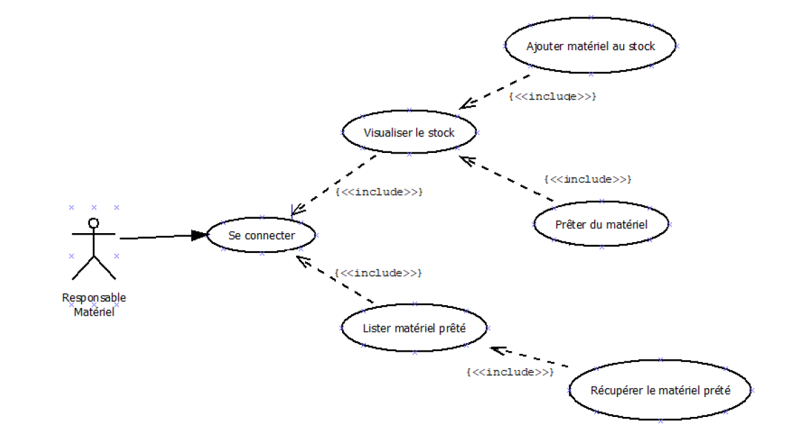

```                                                                                  
  _                       _____      _                
 | |                     |  __ \    | |               
 | |    _   _  ___  _ __ | |__) |_ _| |_ __ ___   ___ 
 | |   | | | |/ _ \| '_ \|  ___/ _` | | '_ ` _ \ / _ \
 | |___| |_| | (_) | | | | |  | (_| | | | | | | |  __/
 |______\__, |\___/|_| |_|_|   \__,_|_|_| |_| |_|\___|
         __/ |                                        
        |___/                                         

```
 
# - Lyon Palme - 
## ***Application : gestion et prêt du matériel.***
  
Projet personnel encadré réalisé par **PERRAT Tom et BERRETTONI MILAN**,
étudiants en 2e année de **BTS Services Informatiques aux Organisations Option SLAM**.  

Professeur : Mme CHATAING  
Sup'Chassagnes - 69600, Oullins  
 
---

## Sommaire
1. [Introduction](#1-introduction)  
  1.1. [Présentation de l'application](#11-Présentation-del'application)  
  1.2. [Technologies et savoir-faire mis en oeuvre](#12-technologies-et-savoir-faire-mis-en-oeuvre)  
2. [Utiliser l'application](#2-utiliser-lapplication)  
  2.1. [Environnement logiciel requis](#21-environnement-logiciel-requis)  
  2.2. [Compte SSMS pour se connecter à la base de données](#22-Compte-SSMS-pour-ce-connecter-a-la-base-de-données)  
  2.3. [Configuration de l'application pour la connexion à la base de données](#23-Configuration-de-l'application-pour-la-connexion-à-la-base-de-données)
  2.3.1 [Chaînes de connexion](#231-Chaînes-de-connexion)    
  2.4. [Authentification dans l'application (formulaire de connexion)](#24-authentification-dans-lapplication-formulaire-de-connexion)   
  2.5. [Navigation entre les formulaires](#25-navigation-entre-les-formulaires)
3. [Annexes](#3-annexes)  
  3.1. [Usercase](#31-Usercase)  
  3.2. [Modèle conceptuel de données](#32-Modèle-conceptuel-de-données)  
  3.3. [Diagramme de classe](#33-diagramme-de-classes)
  3.4. [Diagramme de séquence](#34-diagramme-de-sequence)  
4. [Remerciements](#4-remerciements)  

---

## 1. Introduction
### 1.1. Présentation de l'application
Une application permettant de gérer le matériel du club doit être développée par les personnes du backoffice.
Elle est utilisée par le(s) responsable(s) matériel. Cette application permet d’entrer du matériel en
stock, de faire sortir du matériel du stock, de prêter du matériel à des adhérents.
Elle permet également de « tracer » le matériel c’est-à-dire que, pour un matériel, il faut connaître toutes les
personnes à qui il a été prêté. Cela permettra ainsi de retrouver la personne responsable en cas de détérioration
du matériel.    

### 1.2. Technologies et savoir-faire mis en oeuvre
+ Langage orienté objet : C#
  + WINDOWS FORMS
  + Data Access
  + Forms
    + Dao
      + Mappage 
    + Fonction
  + MODELS
   + Classe Mère
   + Classe 
+ DONNÉES 
  + Base de données relationnelles : SSMS
    + Héritage
    + Liens 1 à * 
    + Procédure stockée 
    + Vue
    + Certificat
    + Chiffrement des données
  + Modélisation des données : UML, MCD
+ Système de contrôle de version :  Git
 
---

## 2. Utiliser l'application  
### 2.1. Environnement logiciel requis
+ Microsoft Windows avec .NET Framework 4.8  
+ Visual Studio code 2019 ou 2022 
+ Sql server management studio 

Informations sur les versions utilisées lors du développement de l'application :  
+ Windows 11 Professionnel 64-bits   
+ SSMS  
+ Visual Studio 2022
+ Visual Studio 2019  

### 2.2. Compte SSMS pour se connecter à la base de données
Les logins que nous avons créés et qui respectent le CRUD :

    USER : Tom
    PASSWORD : AZjdeon.7ed9==
      
Il faudra alors modifier le fichier `app.config` du projet Gestion matériel. Cf. point 2.3.*  

### 2.3. Configuration de l'application pour la connexion à la base de données

Il vous suffit simplement d'ouvrir avec un éditeur de texte le **fichier de configuration `app.config` du projet `GestionMatériel`** (et non pas celui de `GestionMatérielLibrary` !),    
puis de **modifier les valeurs associées aux clés `sourceDonnees` et `proceduresStockees` de la section `appSettings`** : 
  
| Clé                | Valeurs possibles |
|--------------------|-------------------|
| proceduresStockees | oui / non         |
| sourceDonnees      | SSMS              |

*Exemple de section `appSettings` lorsque l'application utilise MySQL sans procédures stockées (configuration par défaut) :*  

    <appSettings>
	    <add key="proceduresStockees" value="non"/>
	    <add key="sourceDonnees" value="mysql"/>
    </appSettings>

#### 2.3.1. Chaînes de connexion
Assurez-vous enfin de personnaliser la **chaîne de connexion** (`gestion_materiel` pour SQL Server) afin de correspondre aux identifiants et caractéristiques de votre base de données.

Ces chaînes se trouvent dans la section `connectionStrings` du même fichier `app.config`.

```csharp
<?xml version="1.0" encoding="utf-8"?>
<configuration>
    <startup>
        <supportedRuntime version="v4.0" sku=".NETFramework,Version=v4.7.2" />
    </startup>
    <connectionStrings>
        <add name="gestion_materiel" connectionString="Data Source=192.168.100.236;Initial Catalog=tomperrat;User ID=LPTom;Password=Ep^biYpxD6" providerName="System.Data.SqlClient" />
    </connectionStrings>
    
```

  

### 2.4. Authentification dans l'application (formulaire de connexion)  
Le(s) responsable(s) du matériel se connecte(nt) à l'application en fournissant l'username et le mot de passe préalablement créés afin qu'il(s) puisse(nt) rentrer pour accéder à l'application.
| Identifiant        | Mot de passe      |
|--------------------|-------------------|
| Tom                | 1234              |

     
### 2.5. Navigation entre les formulaires
#### 2.5.1. Formulaire de connexion
La première interface visible par l'utilisateur est le formulaire de connexion, qui demande au responsable du matériel de saisir son identifiant et son mot de passe pour les vérifier auprès de la base de données.  
+ En cas d'identifiants erronés, le formulaire en informe l'utilisateur, qui peut les saisir de nouveau ou bien quitter l'application.
+ *ATTENTION* dans le cas où le serveur de base de données est inaccessible, la connexion sera toujours possible, mais cela n'affichera aucun élément dans les différents formulaires de notre application, étant donné que le compte est géré dans C#. 

#### 2.5.2. Formulaire Accueil
Une fois l'authentification réussie, l'utilisateur est amené au formulaire principal de l'application.    
L'interface Accueil est composé en deux parties
| Première partie    | Seconde Partie    |
|--------------------|-------------------|
| Navbar             | formulaire stock  |

+ Première partie
  + Une navbar composée de différents éléments, le premier est le fait d'afficher l'username de la personne connectée.
  + La seconde utilité de cette navbar est de pouvoir accéder au deuxième windows forms *Voir prêt*.
  + Nous avons également deux boutons qui permettent l'ajout d'une combinaison ou d'une monopalme.
  + Un bouton refresh qui permet de mettre à jour les données est aussi présent.


+ Seconde Partie
  + Un formulaire qui permet l'affichage du stock.
  + Nous pouvons voir que ce tableau est la représentation de notre table Stock avec id, marque, Taille, Saison, Pointure, Type.

#### 2.5.3. Formulaire Voir Prêt
Cette page permet de lister tout les prêts.
+ La première fonctionnalité et de pouvoir récupérer le prêt.
+ Nous pouvons ajouter un prêt.
+ Nous pouvons voir les nageurs afin de déterminer à quel ID ces derniers appartiennent.
+ Un bouton refresh.

#### 2.5.4. Exécutable

Pour faire l'exécutable il y a quelques petites étapes à respecter :
| Appuyez sur "Générer" puis sur "Publier gestion matériel" | Appuyez sur terminer | Appuyez sur setup.exe |  
|---|---|---|
|  |  |  |  

Et enfin appuyez sur "Installer", après toutes ces étapes nous pourrons accéder à notre application.

---
## 3. Annexes  
### 3.1. UserCase    
 

### 3.2. Modèle conceptuel de données  
  
  
### 3.3. Diagramme de classes
 

### 3.4. Diagramme de séquence


---

## 4. Remerciements 
Nous tenons à remercier notre professeure Madame Chataing pour ses précieux enseignements fournis tout au long de nos années d'études.

Voici les différentes sources que nous avons pu utiliser.
  + [Documentation Microsoft SQL](https://learn.microsoft.com/en-us/sql/t-sql/language-reference?view=sql-server-ver16)
  + [Documentation C#](https://learn.microsoft.com/fr-fr/dotnet/csharp/)
